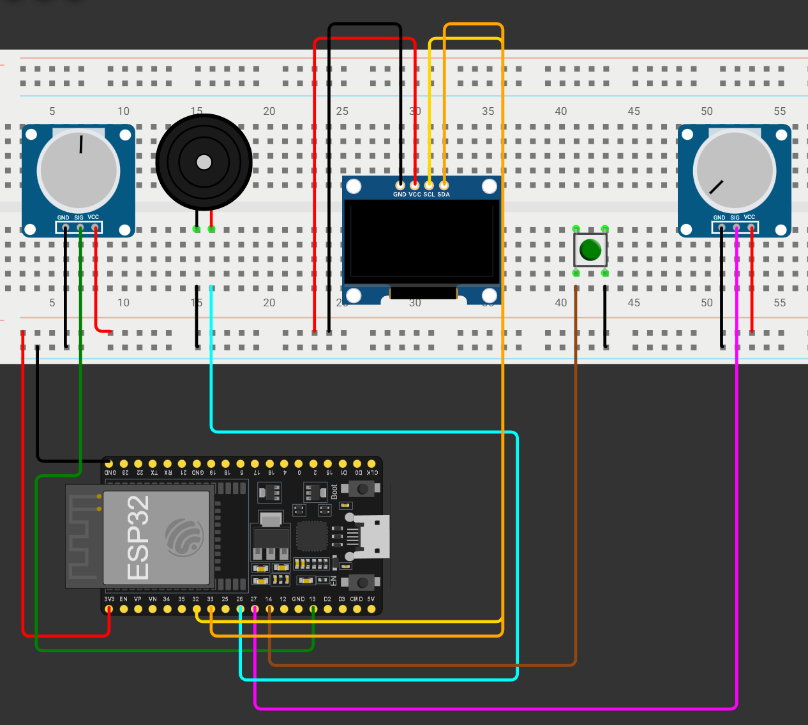

# ESP32 Pong Game

A simple Pong game for ESP32 with OLED display using Arduino library. It has a CPU mode and a 2 player mode which can be selected with Potentiometer 1 and button.

## Demo
Try it online: [Wokwi Simulation](https://wokwi.com/projects/451725260180846593)

## Components

- ESP32 DevKit
- SSD1306 OLED Display (128x64, I2C)
- 2x Potentiometers (10kΩ)
- Push Button
- Passive Buzzer
- Breadboard & Jumper Wires

## Wiring

| Component | ESP32 Pin |
|-----------|-----------|
| OLED SDA | GPIO 33 |
| OLED SCL | GPIO 32 |
| Potentiometer 1 | GPIO 13 |
| Potentiometer 2 | GPIO 27 |
| Button | GPIO 14 |
| Buzzer | GPIO 26 |

## Libraries
- Arduino
- Adafruit SSD1306
- Adafruit GFX Library
